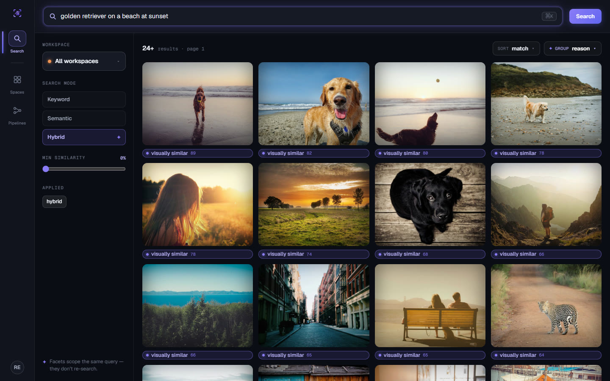
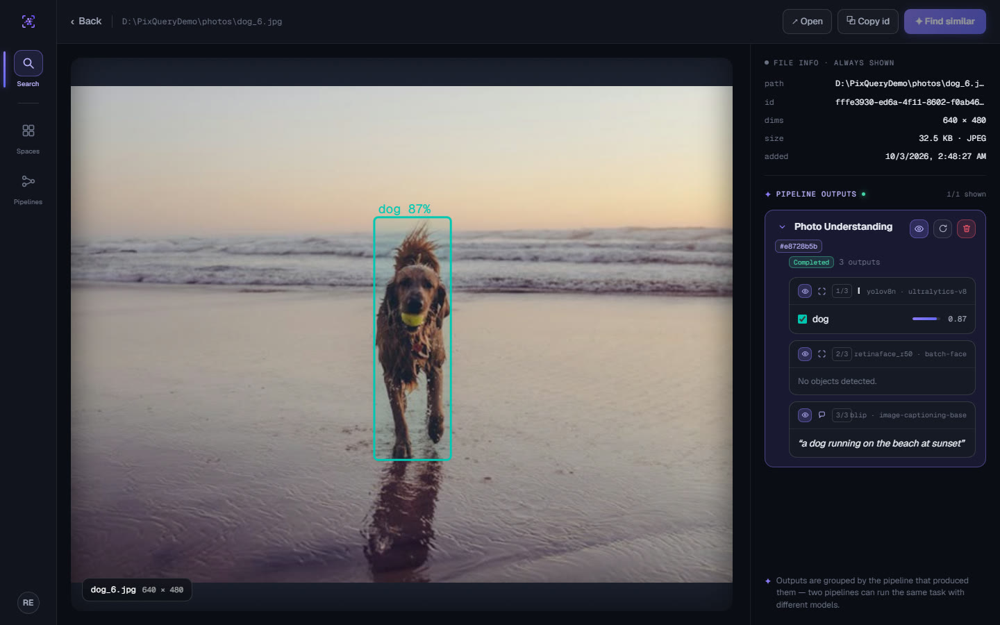
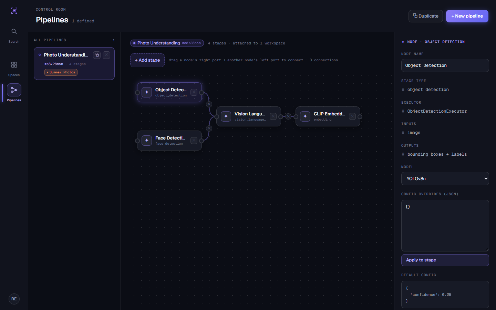
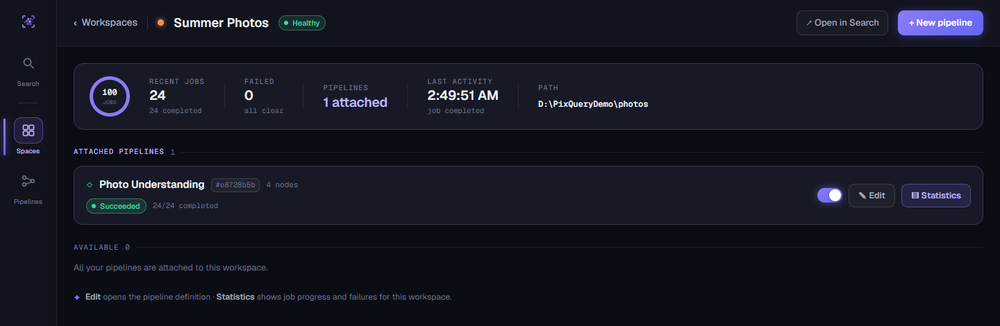
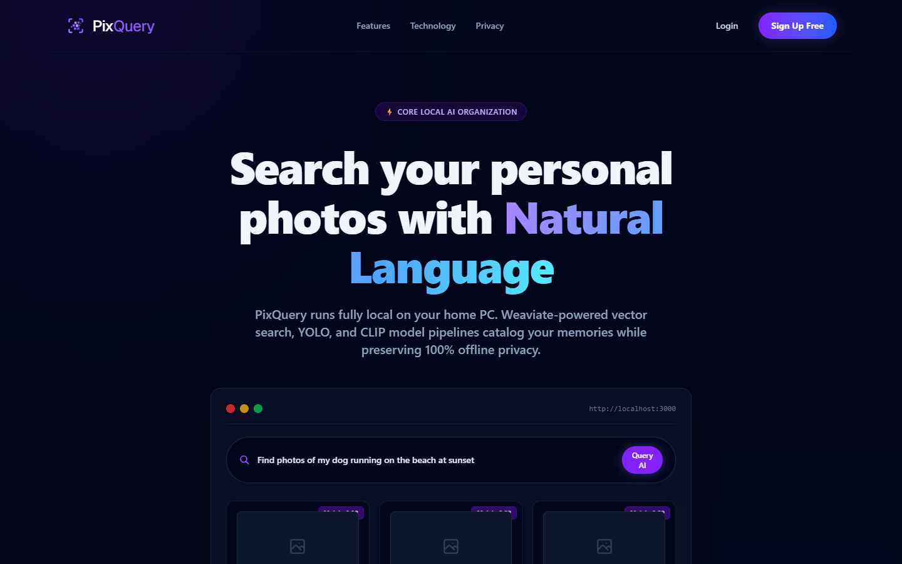
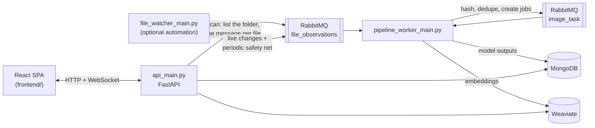

# PixQuery

**Find the moment, not the file.**

PixQuery is a local-first AI photo search and processing system. Point it at
folders of images and it runs each one through configurable AI pipelines — object
and face detection, captioning with a vision-language model, CLIP embeddings, OCR
— then lets you find photos by describing them: *"golden retriever on a beach at
sunset"*.

Everything runs on your own machine. Your images and the AI's outputs never leave it.

[](docs/media/pixquery-teaser.mp4)

<sub>▶ Click the preview to watch the 24-second teaser (MP4, with sound).</sub>

## What you can do

- **Search by meaning, not filenames.** Keyword, semantic (CLIP vectors in Weaviate),
  and hybrid search (both, fused and re-ranked).
- **Build your own processing pipelines.** A pipeline is a graph of stages you wire
  together in a visual editor, and every AI stage lets you pick the model:

  | Stage | Models |
  |---|---|
  | Object detection | YOLOv8 n / s / m |
  | Face detection | YuNet, SCRFD, RetinaFace-R50 |
  | Classification | ResNet-50, EfficientNet-B0, ViT-B/16 |
  | Vision-language model | BLIP, Qwen2-VL-2B, Moondream2 — the last two follow a **custom prompt** you write ("what brand is visible?") |
  | Embedding | CLIP ViT-B/32, CLIP ViT-L/14, DINOv2 |
  | OCR | Tesseract |
  | Utilities | resize, grayscale, write image |

- **Organise photos into workspaces** that watch a folder, and share them with
  teammates as owner / editor / viewer.
- **Watch it work.** Job state and per-stage progress stream to the UI live over a
  WebSocket; every image shows which model produced each output, and when.
- **Use your GPU.** Models run on CUDA when it's available.

## A quick tour

**Search** — describe what you want. Here the four golden retrievers rank first, then
the near-misses (a sunset field, a dog that isn't on a beach).



**Image detail** — every output a pipeline produced, with the model that made it: the
YOLO detection box drawn on the photo, face detection, and the BLIP caption.



**Pipelines** — wire stages into a graph. Here two detectors feed a captioner, which
feeds the CLIP embedding. Pick a model per stage and tweak its settings.



**Workspaces** — a watched folder plus the pipelines that run on it, with live job
health.



<details>
<summary>The landing page</summary>



</details>

<sub>Screenshots use the same placeholder photos as the teaser (Unsplash, via
[Picsum](https://picsum.photos)).</sub>

## How it works

Three backend processes cooperate through MongoDB, RabbitMQ and Weaviate. The
design rule: **things that find files only detect; the pipeline worker is the one
place that turns a found file into work.**



1. **Detect.** Pressing **Scan** in the UI makes the API list the workspace folder
   and publish one message per file. The optional file watcher does the same
   automatically as files appear. Neither hashes or processes anything.
2. **Ingest.** The pipeline worker takes each message, waits for the file to
   finish copying, hashes it, de-duplicates within the workspace, and creates a job
   per attached pipeline.
3. **Process.** The worker runs each job's pipeline graph stage by stage, stores the
   outputs in MongoDB and the vectors in Weaviate, and broadcasts progress.
4. **Search.** The API answers queries by keyword match, by CLIP vector similarity,
   or by fusing both.

Because Scan doesn't depend on the watcher, **you only need the API and the worker
running** to use PixQuery. Run the watcher if you want new files picked up
automatically.

## Requirements

- Docker & Docker Compose (for MongoDB, RabbitMQ and Weaviate)
- Python 3.10+ and Node.js 18+
- ~16 GB RAM recommended
- A CUDA GPU is strongly recommended (see [GPU notes](#gpu-notes))

## Quick start

Run these in separate terminals; the backend processes are long-running.

```bash
# 1. Infrastructure — MongoDB :27017, RabbitMQ :5672 (UI :15672), Weaviate :8080
docker compose -f docker-compose.infra.yml up -d

# 2. Backend dependencies (uv recommended; plain pip also works)
cd backend
uv sync --all-extras                    # or: pip install -r requirements.txt

# 3. API server                         → http://localhost:8000
uv run uvicorn api_main:app --reload --port 8000

# 4. Pipeline worker (new terminal, in backend/)
uv run python pipeline_worker_main.py

# 5. File watcher — optional, only for automatic detection (new terminal, in backend/)
uv run python file_watcher_main.py

# 6. Frontend (new terminal)            → http://localhost:3000
cd frontend
npm install
npm start
```

If you use plain pip instead of uv, drop the `uv run` prefix.

The first worker run downloads model weights (YOLO, BLIP, CLIP, …), which can take a
few minutes. Set `SECRET_KEY` in any non-local deployment (it signs login tokens);
every other setting has a default in `backend/src/config.py`.

`docker compose up` builds and runs the `api`, `pipeline-worker`, `file-watcher` and
`frontend` services together on top of the infrastructure containers.

## Try it end to end

1. Open `http://localhost:3000`, register an account, and log in.
2. **Pipelines → New pipeline.** Add stages (for example Object Detection →
   Vision Language Model → Embedding), connect them, and pick a model for each.
3. **Spaces → New workspace.** Give it the **absolute path** of a folder of images
   (the bundled `backend/samples` works) and attach your pipeline. See
   [workspace paths](#workspace-paths-across-windows--wsl--docker) if the backend
   runs in Docker.
4. Press **Scan**. Watch the workspace's job count climb as jobs go
   `queued → processing → completed`.
5. Go to **Search**, switch to **Hybrid**, and describe a photo. Open a result to see
   its detections and caption.

For a fast wiring check that needs **no infrastructure or model weights**:

```bash
cd backend && python -m unittest tests.test_smoke_search
```

## GPU notes

- Every neural model runs on CUDA when it's available. The exceptions are Tesseract
  (not a neural network) and the YuNet face detector (the OpenCV build has no CUDA).
- **SCRFD** needs `onnxruntime-gpu` on a GPU machine. With only the CPU build of
  `onnxruntime` installed it fails with a clear message rather than silently running
  on the CPU.
- **Small cards (4 GB).** BLIP, CLIP, YOLO and the detectors run comfortably. The two
  2B-parameter vision-language models (Qwen2-VL, Moondream2) are about the size of the
  card, so they work but take minutes per image. The worker keeps only one heavy model
  on the GPU at a time and parks the others in system RAM.
- If CUDA hits an unrecoverable error, the worker puts the current job back on the
  queue and **exits with code 3** so a restart gets a clean GPU.

## Workspace paths across Windows / WSL / Docker

A workspace's path is interpreted by **every process that reads it** — the API (Scan),
the pipeline worker (hashing and processing) and the file watcher — so it must be valid
for all of them:

- **Everything native (host Python):** use a normal host path
  (`/home/you/photos`, or `C:\Users\you\Photos` on Windows).
- **WSL running the backend:** use the WSL view of the path. A Windows folder
  `D:\Photos` is `/mnt/d/Photos` inside WSL.
- **Backend in Docker:** the containers only see folders you bind-mount. Mount the host
  folder into the `api`, `pipeline-worker` and `file-watcher` services (for example
  `- /mnt/d/Photos:/data/photos`) and register the workspace as the **container** path
  (`/data/photos`), not the host path.

If a workspace shows no activity, the path almost certainly isn't visible to one of
those processes — check this first.

## Troubleshooting

- **Scan finds files but nothing is processed** — the pipeline worker isn't running or
  can't reach RabbitMQ. Check its output and that
  `docker compose -f docker-compose.infra.yml ps` shows RabbitMQ healthy. The RabbitMQ
  UI (`http://localhost:15672`, guest/guest) should show a consumer on both
  `file_observations` and `image_task`.
- **"This workspace has no pipelines attached"** — attach at least one pipeline before
  scanning. A pipeline with no stages produces no jobs.
- **New files aren't picked up automatically** — that's the file watcher's job; start
  `file_watcher_main.py`, or just press Scan.
- **Jobs go to `failed`** — open the job or image to read the recorded error. Model
  failures now fail the job with the real reason (and retry with backoff) instead of
  completing with empty results. Common causes are missing weights on the first run or
  a file that changed during processing.
- **The worker exited with code 3** — CUDA hit an unrecoverable error (usually running
  out of GPU memory). The job was re-queued; restart the worker. Close other GPU-heavy
  programs, or avoid chaining several large models in one pipeline on a small card.
- **Semantic search returns nothing / falls back to keyword** — Weaviate is unreachable
  or no embeddings exist yet (no completed jobs with an Embedding stage). Keyword search
  works without Weaviate.
- **Frontend can't reach the API** — the SPA targets `http://localhost:8000`; make sure
  the API is up and that CORS (`allow_origins` in `backend/src/api/app.py`) allows the
  frontend's origin.
- **OCR jobs fail** — the OCR stage uses `pytesseract`, which needs the Tesseract binary
  on the worker host (e.g. `apt-get install tesseract-ocr`).

## Tests

```bash
cd backend && python -m unittest discover tests     # ~580 tests
cd frontend && npm test                              # ~160 tests

# backend with the coverage gate (fails below 91%)
cd backend && python -m coverage run -m unittest discover tests && python -m coverage report
```

## Documentation

- `CLAUDE.md` — architecture, module map and conventions (the most detailed reference).
- `AGENTS.md` — contributor / agent execution guide.
- `technical-requirement-doc.md` — technical requirements and API reference.
- `obsidian/PixQuery/` — product vision, engineering notes and the implementation backlog.
- `docs/media/` — the teaser video and the screenshots used above.
