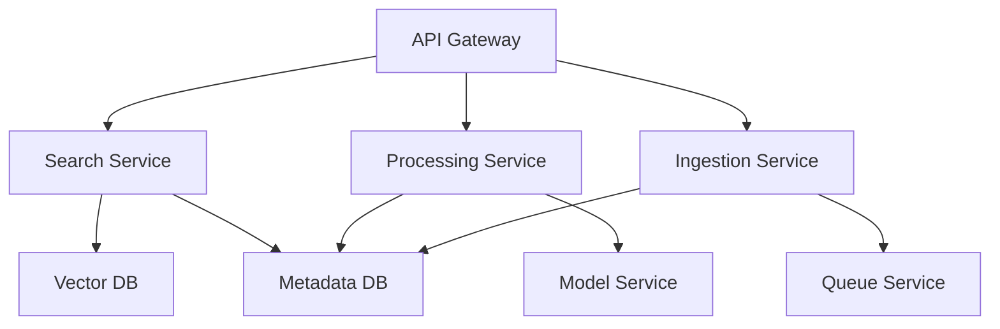

# Future Roadmap and Limitations

## Current Limitations

### Scalability Constraints

#### Database Limitations
- **SQLite Single-Writer**: Only one process can write to database at a time
- **No Connection Pooling**: Each operation opens new connection
- **Limited Concurrency**: Not suitable for >10 concurrent users
- **File Locking**: Database locks can cause processing delays

**Impact**: System cannot handle high-throughput scenarios or multiple simultaneous processing workers effectively.

**Potential Solutions**:
- Migrate to PostgreSQL for better concurrency
- Implement connection pooling with SQLAlchemy
- Add database sharding for large collections

#### Vector Database Scaling
- **Single Qdrant Instance**: No clustering or replication
- **Memory Requirements**: All embeddings loaded into RAM
- **Search Performance**: Degrades with >1M embeddings
- **Backup/Recovery**: No automated backup system

**Impact**: Search performance decreases significantly with large image collections (>100K images).

#### Processing Bottlenecks
- **GPU Memory**: Limited by single GPU VRAM (typically 4-12GB)
- **Model Loading**: Models loaded per worker, not shared
- **CPU Fallback**: Dramatically slower without GPU acceleration
- **Memory Leaks**: Potential accumulation in long-running workers

### Performance Characteristics

#### Current Benchmarks (on RTX 3080, 12GB VRAM)
```
YOLO Detection:     ~0.2s per image
CLIP Embedding:     ~0.1s per image  
BLIP Description:   ~0.5s per image
Total Processing:   ~0.8s per image
Search Query:       ~0.05s for 10K embeddings
```

#### Resource Requirements
- **Minimum RAM**: 8GB (CPU-only mode)
- **Recommended RAM**: 16GB (GPU + multiple workers)
- **GPU VRAM**: 4GB minimum, 8GB+ recommended
- **Storage**: ~1MB per 1000 processed images (metadata + embeddings)

## Security Considerations

### Current Security Posture

#### File System Security
- **Unrestricted File Access**: No sandboxing of image processing
- **Path Traversal**: Limited validation of image paths
- **Directory Access**: Full access to `~/pixquery_photos` and subdirectories

**Risks**: Malicious images could potentially exploit file system access.

#### API Security
- **No Authentication**: All endpoints publicly accessible
- **CORS Configuration**: Currently allows localhost:3000 only
- **Input Validation**: Limited sanitization of search queries
- **Rate Limiting**: No protection against abuse

**Recommendations**:
```python
# Add authentication middleware
from fastapi import Depends, HTTPException, status
from fastapi.security import HTTPBearer

security = HTTPBearer()

@app.get("/search")
async def search(query: str, token: str = Depends(security)):
    # Validate token
    pass
```

#### Data Privacy
- **Local Processing**: Good - no external API calls
- **Model Downloads**: Downloads from external sources (security risk)
- **Logging**: May contain sensitive file paths in logs

### Infrastructure Security

#### Container Security
- **Root Privileges**: Some containers run as root
- **Network Exposure**: Services exposed on localhost only
- **Image Vulnerabilities**: Base images may have security issues

**Improvements**:
```dockerfile
# Run as non-root user
FROM python:3.9-slim
RUN useradd -m -u 1000 pixquery
USER pixquery
```

## Performance Optimization Roadmap

### Short-Term Improvements (3-6 months)

#### Model Optimization
- **Model Quantization**: Reduce YOLO/CLIP model sizes by 50-75%
- **Batch Processing**: Process multiple images in single GPU call
- **Model Caching**: Share loaded models between workers
- **Mixed Precision**: Use FP16 for faster inference

**Expected Impact**: 2-3x faster processing, 40% less memory usage

#### Database Optimization
- **Connection Pooling**: Implement SQLAlchemy with connection pool
- **Batch Writes**: Group database updates into transactions
- **Index Optimization**: Add indexes for common query patterns
- **WAL Mode**: Enable write-ahead logging for better concurrency

#### Search Performance
- **Embedding Caching**: Cache frequent search embeddings
- **Approximate Search**: Use HNSW algorithm in Qdrant for faster queries
- **Search Filters**: Add metadata filters to reduce search space
- **Result Pagination**: Implement cursor-based pagination

### Medium-Term Architecture Changes (6-12 months)

#### Microservices Architecture


#### Distributed Processing
- **Kubernetes Deployment**: Scale workers horizontally
- **Model Serving**: Dedicated model inference service (TorchServe/Triton)
- **Queue Distribution**: RabbitMQ clustering for reliability
- **Load Balancing**: Multiple API instances behind nginx

#### Advanced Features
- **Facial Recognition**: Add face detection and clustering
- **Video Processing**: Extend to video frame analysis
- **Duplicate Detection**: Identify and group similar images
- **Smart Albums**: Auto-generate themed collections

### Long-Term Vision (1-2 years)

#### Enterprise Features
- **Multi-User Support**: User isolation and permissions
- **Organization Management**: Team-based photo libraries
- **Advanced Analytics**: Usage metrics and insights dashboard
- **API Rate Limiting**: Per-user quotas and throttling

#### AI Model Improvements
- **Custom Fine-Tuning**: Train models on user's specific photo collection
- **Multi-Modal Search**: Combine text, image, and metadata search
- **Semantic Tagging**: Automatic hierarchical tag generation
- **Context Understanding**: Scene and activity recognition

#### Platform Extensions
- **Mobile App**: React Native companion app
- **Desktop Integration**: Native desktop client
- **Cloud Sync**: Optional encrypted cloud backup
- **Plugin System**: Third-party model integrations

## Migration Considerations

### Database Migration Path

#### Phase 1: SQLite to PostgreSQL
```sql
-- Migration script for PostgreSQL
CREATE TABLE images (
    id SERIAL PRIMARY KEY,
    path TEXT UNIQUE NOT NULL,
    detections JSONB,
    description TEXT,
    processed BOOLEAN DEFAULT FALSE,
    created_at TIMESTAMP DEFAULT CURRENT_TIMESTAMP,
    updated_at TIMESTAMP DEFAULT CURRENT_TIMESTAMP
);

CREATE INDEX idx_images_processed ON images(processed);
CREATE INDEX idx_images_path ON images(path);
CREATE INDEX idx_images_created ON images(created_at);
```

#### Phase 2: Sharding Strategy
```python
# Horizontal sharding by image ID
def get_shard_id(image_id: int) -> int:
    return image_id % NUM_SHARDS

def get_database_connection(shard_id: int):
    return db_connections[shard_id]
```

### Vector Database Migration

#### Qdrant to Distributed Setup
```python
from qdrant_client import QdrantClient

# Multi-node Qdrant cluster
clients = [
    QdrantClient(host="qdrant-1.internal", port=6333),
    QdrantClient(host="qdrant-2.internal", port=6333),
    QdrantClient(host="qdrant-3.internal", port=6333)
]

def get_client_for_collection(collection_name: str):
    # Distribute collections across nodes
    shard = hash(collection_name) % len(clients)
    return clients[shard]
```

## Breaking Changes to Watch For

### Upcoming Version Compatibility Issues

#### Model Format Changes
- **YOLO v9/v10**: Different output format, requires code changes
- **CLIP Updates**: New embedding dimensions or preprocessing
- **Transformers Library**: Breaking API changes in major versions

#### Database Schema Evolution
```sql
-- Planned schema additions
ALTER TABLE images ADD COLUMN file_hash TEXT;
ALTER TABLE images ADD COLUMN file_size INTEGER;
ALTER TABLE images ADD COLUMN exif_data JSONB;

-- New tables for advanced features
CREATE TABLE image_faces (
    id SERIAL PRIMARY KEY,
    image_id INTEGER REFERENCES images(id),
    face_embedding VECTOR(512),
    bounding_box JSONB
);
```

#### API Version Management
```python
# Versioned API endpoints
@app.get("/v1/search")  # Current
async def search_v1(query: str, limit: int = 10):
    # Legacy implementation

@app.get("/v2/search")  # Future
async def search_v2(query: str, filters: dict = None, limit: int = 10):
    # New implementation with advanced features
```

## Monitoring and Alerting Strategy

### Key Metrics to Track
- **Processing Rate**: Images processed per hour
- **Error Rate**: Percentage of failed processing attempts  
- **Search Response Time**: 95th percentile query latency
- **System Resource Usage**: CPU, RAM, GPU utilization
- **Queue Depth**: Number of pending images to process

### Recommended Monitoring Stack
```yaml
# docker-compose.monitoring.yml
version: "3.8"
services:
  prometheus:
    image: prom/prometheus
    ports:
      - "9090:9090"
      
  grafana:
    image: grafana/grafana
    ports:
      - "3001:3000"
      
  redis-exporter:
    image: oliver006/redis_exporter
    environment:
      REDIS_ADDR: "redis:6379"
```

### Alert Conditions
- Processing queue >1000 images for >1 hour
- API response time >5 seconds for >5 minutes
- GPU utilization <10% during processing hours
- Disk usage >90%
- Error rate >5% over 15 minutes

## Research and Development Areas

### Experimental Features
- **Federated Learning**: Improve models without centralizing data
- **Edge Computing**: Process images on IoT devices
- **Blockchain Integration**: Immutable image provenance tracking
- **AR/VR Integration**: 3D spatial photo organization

### Academic Collaborations
- **Computer Vision Research**: Partner with universities on new models
- **Privacy-Preserving ML**: Develop homomorphic encryption for embeddings
- **Efficient Neural Networks**: Research model compression techniques

### Open Source Ecosystem
- **Plugin Architecture**: Allow community model contributions
- **Dataset Creation**: Generate synthetic training data for rare scenarios
- **Benchmark Suite**: Standard evaluation metrics for photo search systems

This roadmap provides a structured approach to evolving PixQuery from a local photo organizer into a comprehensive, scalable AI-powered media management platform while maintaining its core privacy-focused principles.